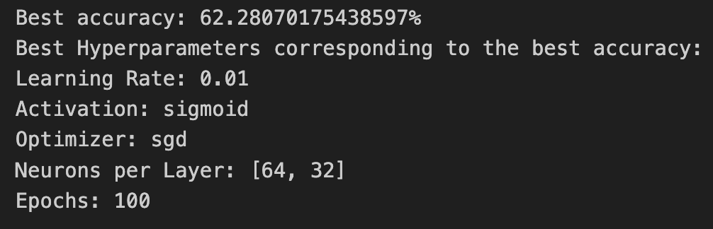
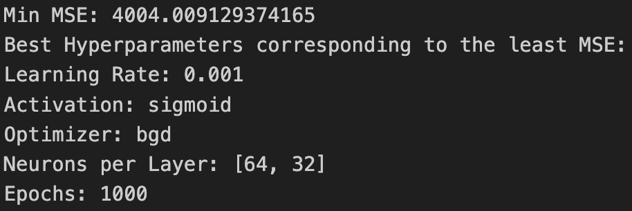

# MLP-from-scratch
Multi-Layer Perceptron Neural Network from scratch

## 1. Introduction

This model can perform regreession, classification and multi-label classification. The models hyperparameter tuning has been done and the best parameters for the model have been mentioned later.

##  2.1 Classification

For this task, we will train this model on Wine Quality Dataset (WineQT.csv) to classify a wine’s quality based on the values of its various contents.

### 2.1.1 Best parameters for classification

### 2.1.2 Results on test set

Test Set Performance:

$$Accuracy: 24.347826086956523\%$$
$$Precision: 67.97138047138046$$
$$Recall: 32.42651657285804$$
$$F1\ Score: 24.347826086956523$$

## 2.2 Regression

We will be using the Boston Housing dataset and the task is to predict housing prices. In this dataset, the column MEDV
gives the median value of owner-occupied homes in $1000’s.

### 2.1.1 Best parameters for regression

### 2.1.2 Results on test set

Test Set Performance:

$$MSE: 3767.8465849181566$$
$$RMSE: 61.38278736680306$$
$$R-squared\ error: 0.9813910494189263$$

